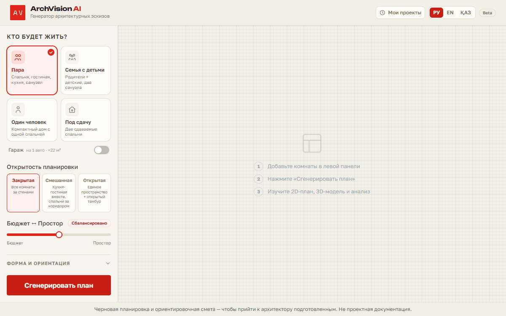
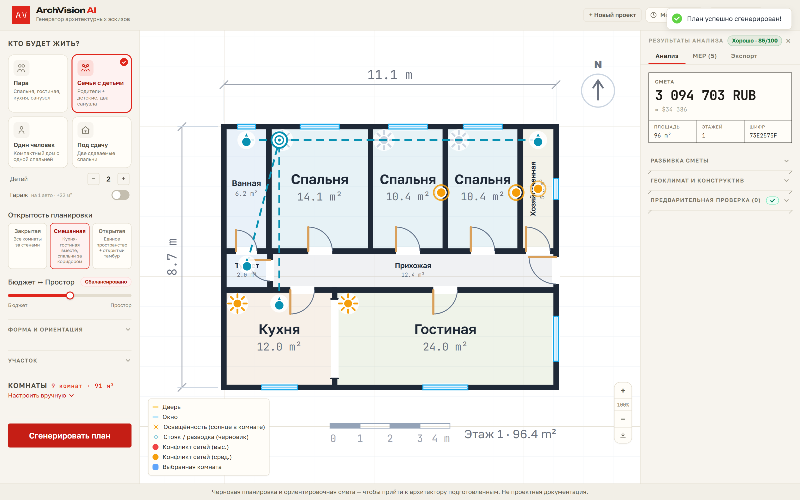

# ArchVision AI

**Household → buildable-looking draft in seconds.** 2D floor plan, plumbing draft,
cost estimate, localized PDF report and IFC export for residential houses in the
RU/KZ/CIS market. Генератор архитектурных эскизов: планировка, черновик
инженерки и ориентировочная смета — чтобы прийти к архитектору подготовленным.





## What it does

- **2D floor plan** from a household preset (couple / family / single / rental) or a
  custom room list — deterministic central-hall layout engine, with an optional
  LLM loop (Groq) that is *validated by the same geometry rules and falls back
  to the rule engine*. No API key needed: fully offline by default.
- **9 deterministic invariants** checked on every plan and shipped as visible
  red flags (never a silent "best effort"): overlaps/coverage, areas, door on
  every room, no transit through bedrooms, shared wet riser, entry buffer
  (тамбур), wet-over-wet stacking, mandatory kitchen+bath, minimum usable room
  dimensions.
- **Plumbing draft (MEP v1)** — riser placement, branch sketch, clash and
  cost-risk advisories (long branch, wet-over-dry).
- **Daylight** — per-room insolation rating + optional auto-orientation of the
  whole plan to the sun.
- **Cost estimate** — strip-foundation model, local currency (KZT/RUB) with USD
  reference, presented as a drawing title block (штамп).
- **Cost-Δ variants** — the same program at three deterministic spaciousness
  settings (compact / balanced / roomy) as a decision table sorted by cost:
  each row shows the Δ vs the cheapest and its one causal driver
  («+265 570 ₽: +11.8 m² → +5.4 m³ of concrete») plus an honest red-flag count.
  Rule engine only — reproducible, not an LLM gallery.
- **Exports** — localized PDF report (en/ru/kk) with the actual plan drawing,
  IFC (BIM), share-by-link, PNG.

## What it does NOT do (on purpose)

- **Not construction documents.** A draft to arrive at your architect prepared —
  not a replacement for one.
- **Not a building-code (СНиП/СП/ҚНжЕ) review.** The built-in checks cover areas
  and geometry only and say so in the UI and PDF; code compliance needs a
  licensed specialist.
- **Not a buildable MEP spec.** Slopes, pressure and drain sizing are an
  engineer's job — the draft exists so that conversation starts earlier.
- Wall thickness is not yet subtracted from areas (axis-line geometry, one
  consistent figure everywhere).

## Quick start

```bash
cp backend/.env.example backend/.env   # GROQ_API_KEY optional — rule engine works offline
docker compose up --build
```

- Frontend: http://localhost:3000
- API + docs: http://localhost:8000/docs

Without Docker (Windows): `run-local.ps1`, or manually —
`backend\.venv\Scripts\uvicorn main:app --reload --port 8000` (from `backend/`)
and `npm run dev` (from `frontend/`).

Production: `docker compose -f docker-compose.prod.yml up --build -d` — nginx
serves the SPA on :80 and proxies `/api`; projects persist in a volume
(TTL-cleaned); generation is rate-limited per client IP.

## Stack

FastAPI + Python (layout engine, invariants, MEP, cost, reportlab PDF, plain
STEP-file IFC writer — no IfcOpenShell dependency) · React + Vite + TypeScript
+ Zustand + Tailwind (SVG plan renderer) · no database, no accounts — file
store + anonymous device token, share by unguessable link (`#/p/{id}`).

## Architecture

```
User input → GeoClimate calc (frost depth, seismic zone, wall/insulation)
           → Layout engine (central-hall tiling · wet-room stacking ·
             LLM loop gated by deterministic validator → rule-engine fallback)
           → Invariant check (9 rules → visible red flags)
           → Daylight sensor / auto-orientation
           → MEP draft (riser + branches) + clash advisories
           → Cost estimator (strip foundation) → PDF (en/ru/kk) · IFC
```

## Endpoints

| Method | Path | Description |
|--------|------|-------------|
| POST | `/api/v1/generate-plan` | Full generation: plan + analysis + IFC (rate-limited) |
| POST | `/api/v1/compliance-check` | Preliminary checks only |
| POST | `/api/v1/mep-routing` | MEP routing + clash detection |
| GET | `/api/v1/projects` | This device's history (X-Device-Token header) |
| GET | `/api/v1/projects/{id}` | Full stored result (share-by-link) |
| GET | `/api/v1/download/{id}` | Download IFC file |
| GET | `/api/v1/report/{id}?lang=en\|ru\|kk` | Localized PDF report |
| GET | `/api/v1/countries` | Supported countries + regions |
| GET | `/health` | Liveness + storage writability |

## Tests

```bash
cd backend && pytest -q          # 269 tests: engine geometry, invariants, API
cd frontend && npx vitest run && npx tsc --noEmit
```

## Roadmap

1. **Real L/U/T footprints** — non-rectangular silhouettes. The proportions
   control today only stretches a central-hall rectangle (honest, but a
   rectangle); a real L/U/T outline and fitting it to the plot are the same
   solver problem as site placement, so they're likely one pass together.
2. Heating layer in the estimate (heat-loss data already computed).
3. DXF export (`ezdxf`) — the bridge to CIS engineers' AutoCAD workflow.
4. Wall thickness in areas (geometry, PDF, cost, IFC together).
5. 3D viewer polish (currently hidden; code in place).

## License

[MIT](LICENSE)

> Черновая планировка и ориентировочная смета — чтобы прийти к архитектору
> подготовленным. Не проектная документация.
